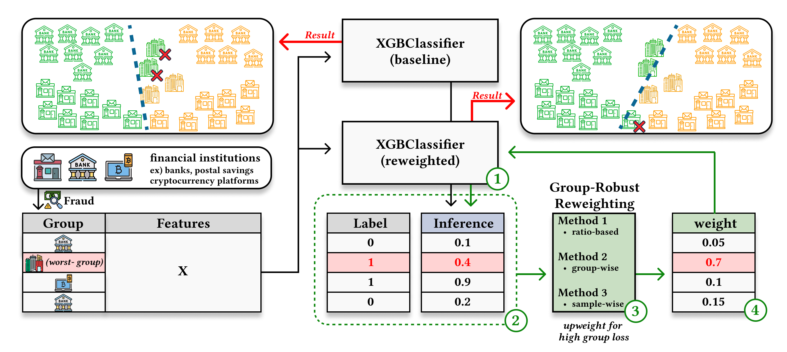

# 📊 Group-Robust Reweighting for Fraud Detection across Financial Domains 



*Figure: Overview of the proposed reweighting framework.*

## 🗂️ Project Structure

<details>
<summary>Click to expand</summary>

```
project/
├── dataset/                    # Raw and processed data
├── models/                     # Model architectures
│   ├── node.py
│   ├── tabnet.py
│   └── __init__.py
├── utils/                      # Utilities for training and evaluation
│   ├── data_loader.py
│   ├── metrics.py
│   ├── train.py
│   └── __init__.py
├── method/                     # Fairness-aware training methods
│   ├── erm.py
│   ├── group_dro.py
│   └── xgb_method.py
├── experiments/                # Example configuration files
│   └── ###.json
├── main.py                     # Main training entry
├── requirements.txt
└── README.md
```

</details>

---

## 🛠️ Installation

Install with `pip`:

```bash
pip install -r requirements.txt
```

**requirements.txt:**
```
torch
pandas
numpy
scikit-learn
xgb
```

✅ All packages are compatible with standard Python environments (tested on Python 3.8+).


After setup, you can run experiments using:

```bash
python main.py --config experiments/[CONFIG].json
```

---

## 📑 Dataset Format

Each dataset should include:

- `target`: binary label (0 or 1)
- `group`: integer indicating group membership (e.g., race, gender)
- `sample_id`: unique identifier
- All other columns: numerical or one-hot encoded features (`float32`)

Datasets are preprocessed via `utils/data_loader.py` and wrapped using `GroupDataset`.

---

## 🔐 Usage Constraints

Due to confidentiality and security policies, the dataset used in our experiments cannot be publicly released.

However, this repository provides the full training pipeline, model architectures, and training methods used in our paper:

- The code is directly usable on **similarly structured tabular datasets** (e.g., COMPAS).
- To adapt the pipeline, follow the format described in [`utils/data_loader.py`](./utils/data_loader.py) and the example configs in [`experiments/`](./experiments/).

If you are a reviewer or collaborating institution with special access, please contact the authors for evaluation or deployment assistance.

---

## 🧠 Supported Models

| Model       | Description & Paper                                                                                  |
|-------------|-------------------------------------------------------------------------------------------------------|
| **NODE**     | [Neural Oblivious Decision Ensembles for Deep Learning on Tabular Data (Popov et al., 2019)](https://arxiv.org/abs/1909.06312) |
| **TabNet**   | [TabNet: Attentive Interpretable Tabular Learning (Arik & Pfister, 2019)](https://arxiv.org/abs/1908.07442) |

---

## ⚙️ Group-Robust Training Methods

| Method       | Description & Paper                                                                                              |
|--------------|------------------------------------------------------------------------------------------------------------------|
| **GroupDRO** | [Distributionally Robust Neural Networks for Group Shifts (Sagawa et al., ICLR 2020)](https://arxiv.org/abs/1911.08731) |

---

**Example config:**

```json
{
  "model_type": "node",
  "method": "group_dro",
  "dataset": "###",
  "model_params": { "hidden_dims": [64, 32], "dropout": 0.1 },
  "train_params": { "lr": 0.001, "epochs": 10 }
}
```

---

## 📄 Paper

This repository accompanies the following paper submission:

**"Group-Robust Reweighting for Fraud Detection across Financial Domains"**  
_Inwoo Tae, Hyeongwoo Kong, Yongjae Lee_  
Submitted to **The 34th ACM International Conference on Information and Knowledge Management (CIKM 2025)**  
Seoul, Republic of Korea · November 10–14, 2025

> Please do not cite this work yet, as it is currently under review.

---

💡 Feel free to open an issue or PR for questions or improvements!


## 📄 License

This project is licensed under the MIT License. See the [LICENSE](./LICENSE) file for details.